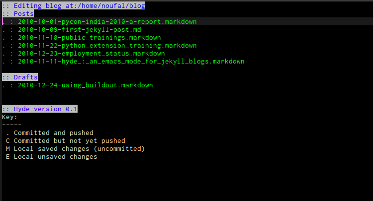

Introduction
------------
Hyde is an Emacs major mode to help create blogs with the excellent
[Jekyll](http://jekyllrb.com/) blogging system. It comes with a front
end (`hyde.el`), a version control backend (`hyde-git.el`) and an
slightly modified version of the stock markdown editing mode that
gives you a few bells and whistles while writing posts
(`hyde-md.el`). 

Installation
------------
Download the all the `hyde-*.el` files and put them somewhere. Once
you do that, add the directory where you put it to your load path like
so and `require` it.


    (add-to-list 'load-path "/path/to/hyde*.el")
    (require 'hyde)


Operation
---------
This mode is a simply a wrapped for a number of shell commands that
are used to create and deploy the site. It doesn't maintain any local
state (in the form of status files etc.) so if you change your
repository manually outside it, just refreshing the buffer will bring
it upto date.

It's tailored to the way I work. I keep my posts in a `git` repository
(although I do have a crude DVCS abstraction layer if you're using
`hg` or any other such system). I make changes, commit them and push
the repository to `github` (you can, for example, see this files
source at
[github](https://github.com/nibrahim/nibrahim.net.in/blob/master/_posts/2010-11-11-hyde_%3A_an_emacs_mode_for_jekyll_blogs.markdown)).
After that, I make the site using `jekyll` manually and then copy it
over to my webspace using `rsync`. I don't use any of the git hooks
(yet).

Customisation
-------------
    
The variables that you might care to customise are

* Location parameters
  * `hyde-home` : The root directory of your blog
  * `hyde-deploy-dir` : The directory where `jekyll` will generate the site for you to deploy
  * `hyde-posts-dir` : The directory that will contain the actual posts
	  (this is relative to `hyde-home` and is `_posts` by default).
  * `hyde-drafts-dir` : The directory that will contain the post
	  drafts (this is relative to `hyde-home` and is `_drafts` by
	  default. You might want to _ignore_ this directory in
	  `_config.yml` ).
  * `hyde/deploy-command` : The command used to deploy the site. `scp`,
	  `rsync` or whatever else you might please.

* VC parameters
  * `hyde/vc-uncommittedp` : Predicate to check whether the file is uncommitted
  * `hyde/vc-unpushedp` : Predicate to check whether the file is not yet pushed
  * `hyde/vc-pushedp` :  Predicate to check if the file has been pushed (inverse of the above)
  * `hyde/vc-add` : Command to add the file
  * `hyde/vc-commit` : Command to commit a file
  * `hyde/vc-push` : Command to push the local changes to the remote end.
  * `hyde/vc-rename` : Command used to rename a file.
  
Interface
---------
  
The main interface looks like the following screenshot

The list of posts are presented on top along with a key of what the
letters before the post names mean. The post names are also colourised
accordingly

The keys you can use at this time are

* `n` : Create a new draft.
* `c` : Commit the current post
* `P` : Push all pending commits (this is only a VC push. Not
  deployment).
* `j` : Run jekyll and create the new version of the site
* `d` : Deploy the site.
* `g` : Refresh posts (useful if you've done something by hand
  earlier)
* `p` : Promote a post from a draft to a a published post
* `q` : Quit hyde.  
* `RET` : Open the current post for editing.

The markdown mode in which the buffers open up for editing is slightly
modified. It has a few extra covenience bindings

* `C-c C-c` : Save file and finish editing
* `C-c C-v` : Preview file (this is a markdown preview so extra
  `liquid` tags will not work). 

To Do
-----

* Proper previews using a local Jekyll server
* Keep state of deployment so that we know what posts have been
  deployed and what not.
